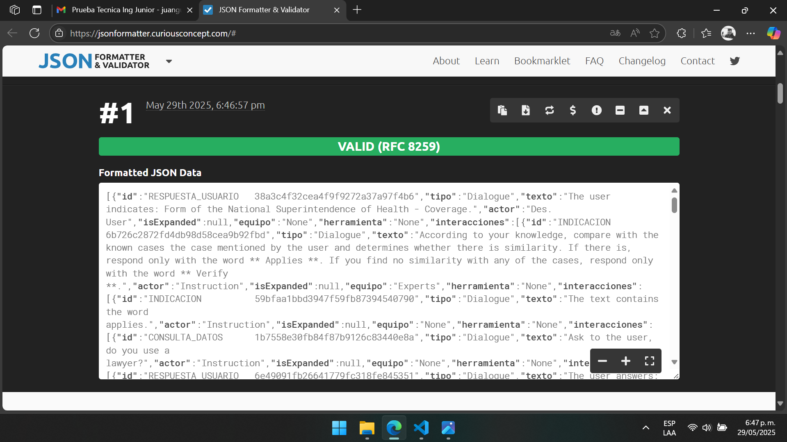

# PRUEBA INGENIERO JUNIOR

---------------

## Misión

Aplicar transformaciones a un archivo JSON.

---------------

## Objetivos

1. Traducir todos los textos al ingles.
2. Reemplazar todos los IDs numericos por cadenas de caracteres únicas de 50 caracteres.
**Nota: los mismos IDs deben mantener la misma cadena si se repiten en el archivo original.**
3.Clasificación dentro del ID:
Los primeros 20 caracteres del nuevo ID deben indicar la categoría del texto asociado, según las siguientes reglas:
     - Si el texto corresponde a una consulta de datos: `CONSULTA_DATOS`
     - Si corresponde a una indicación o instrucción: `INDICACION`
     - Si corresponde a una respuesta de usuario: `RESPUESTA_USUARIO`
     - Si no encaja en ninguna de las anteriores: `OTROS`
4. Validar el resultado con la herramienta: https://jsonformatter.curiousconcept.com

---------------

## Tecnologías usadas

- Python 3.13
- Librería para la traducción: `deep-translator`

---------------

## Pasos para la ejecución

1. Instala las dependencias necesarias:
   pip install deep-translator

2. Ejecuta el script:
   python app.py

3. El resultado será guardado como `Prueba_Transformada.json`.

---------------

## Validación del JSON resultante

El archivo fue validado exitosamente usando la herramienta correspondiente:

---------------

## Estrategia utilizada

1. Se recorren recursivamente todos los nodos e interacciones.
2. Se traducen todos los valores tipo texto con `GoogleTranslator`.
3. Se reemplazan los IDs usando `uuid`, agregando una **categoría** de 20 caracteres según las reglas:
   - Si el actor es `Instrucción` y el texto comienza con “Pregunta” o “Solicita” la categoria es `CONSULTA_DATOS`
   - Si el actor es `Instrucción` sin las palabras clave anteriores la categoria es `INDICACION`
   - Si el actor es `"Des. Usuario"` la categoria es `RESPUESTA_USUARIO`
   - En otros casos la categoria es `OTROS`
4. Se guarda el resultado estructurado y legible con indentación.

---------------

## Autor

> Juan G. Perales
